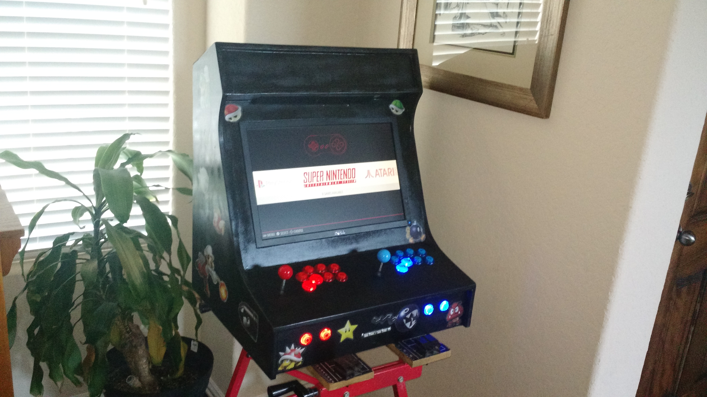
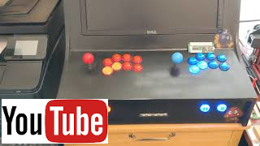

# Event Horizon - Illuminate Joystick Controller 
Last Updated (Mar 13 2021)

Like many of us, I was annoyed by the lack of LED control from the standard zero-delay joystick conrol boards.  All they did was light up every button LED.  I wanted to light up only the buttons that were used for any given game.   Since I couldn't find any inexpensive control boards that could do it, I made my own.

Event Horizon Illuminate Joytick is a RetroPie joystick and button encoder board that also controls the LEDs in the Buttons.  Lighting up ONLY the buttons used by the game you're playing.  A nearly drop-in replacement (size and plugs) for the common zero-delay encoder boards used by many retropie builds.  Only works with 5v LED buttons.  Non-Led buttons will almost certainly burn up the control board.  Make sure your buttons are 5v LEDs.

On the left what I received back from JLCPCB. On the right, a completed board.

## See it in action on [YouTube](https://www.youtube.com/watch?v=Lij-8IOpjkc)

# Features
- Control the LEDs of standard 5v LED Arcade Buttons.
- Compatible with common 3-pin button wiring configuration.
- Nearly Size-Identical most to Zero-Delay boards. For easy retrofit.
- Compatible with all emulators and games.
- Comes with a pre-configured button setup for most Mame games.
- Simple Text-Files allow easy modification of addition of games.
- SleepMode to turn off the LEDs after a period of inactivity (30 minutes). To extend the life of the LEDs.

# Specifications
- Adafruit Trinket M0 CPU
- 12 jst 3-pin button ports.
- 4 jst 2-pin button ports.
- 1 jst 5-pin joystick port.
- 1 jst 2-pin 5v power port.
- 1 micro-usb port.
- max current per LED button 15ma.
- max current for all LED buttons 200ma.
- Compatible with common 5v LED arcade buttons and 3-pin connectors.
- Compatible with common 5-pin Joystick.
- Most Typical Red LED Buttons take 5ma.
- Most Typical Blue LED Buttons take 10ma.

# Make, Buy, Install, Setup
[Assemble Your Own Event Horizon Illuminate Encoder Board](docs/board_assemble.md)

[Buy Ready Made Event Horizon Illuminate Encoder Board (not yet, but soon I hope)]()

[Install and Setup (Wires, firmware & software)](docs/install_and_setup.md)

# External RESOURCES:
- http://forum.arcadecontrols.com/index.php/topic,98241.0.html
- https://retropie.org.uk/forum/topic/1550/led-controller-that-works-with-retropie/13

# TODO / Wishlist:
- add usbhid.jspoll=1 to /boot/config.txt
- Add auto-config support to retro arch? (https://github.com/libretro/retroarch-joypad-autoconfig/blob/master/hid/8BitDo_Zero2_gamepad_BT.cfg)
- command-line firmware update
- command-line game configuration update