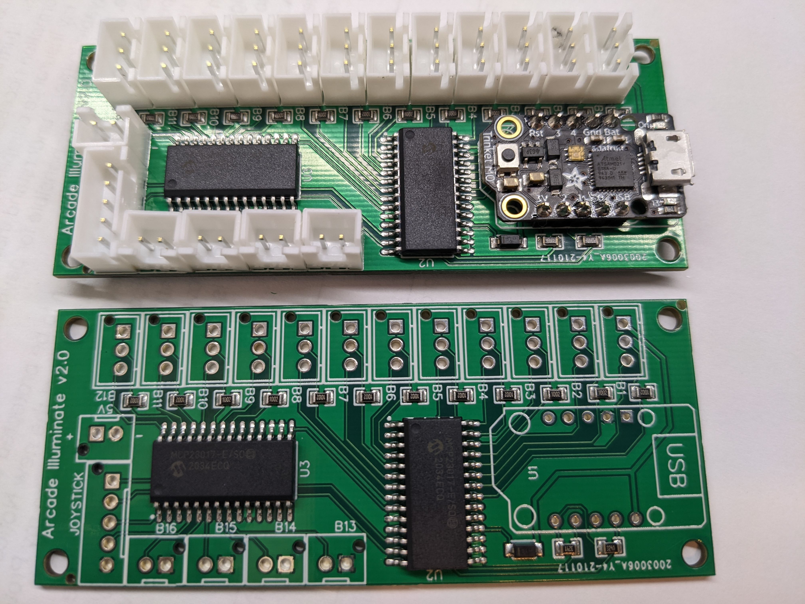
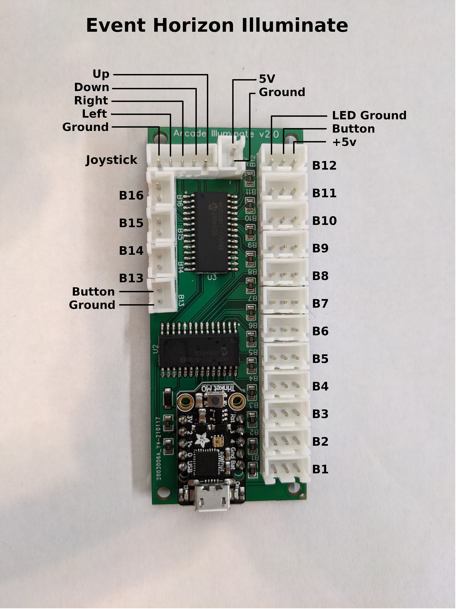
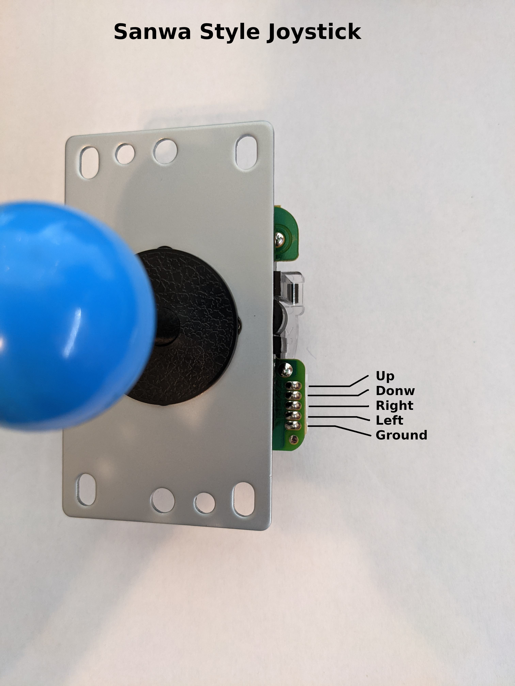
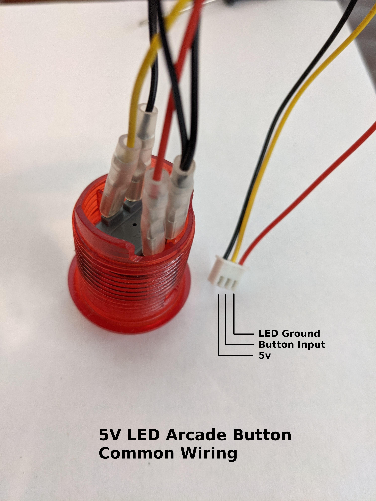
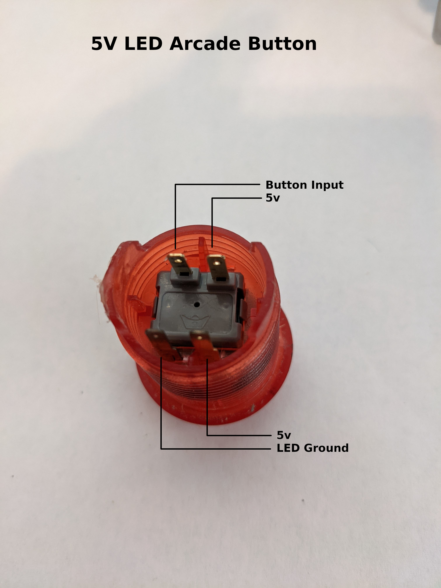
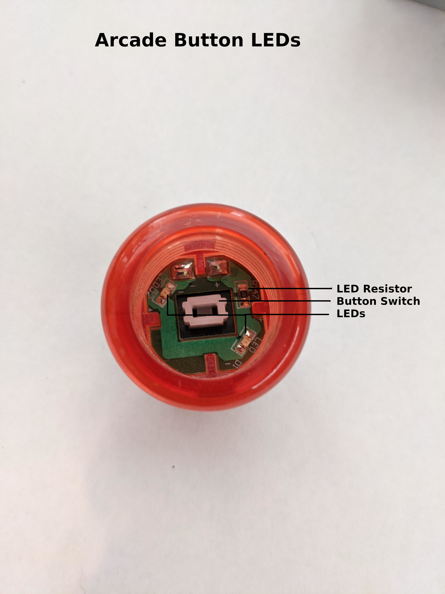
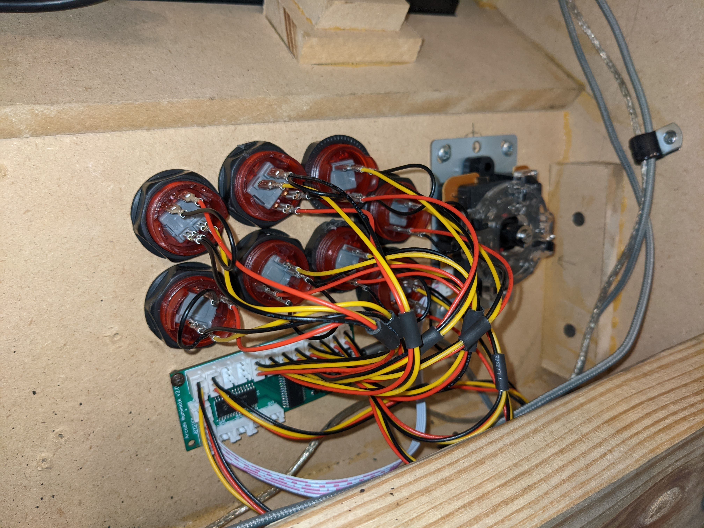
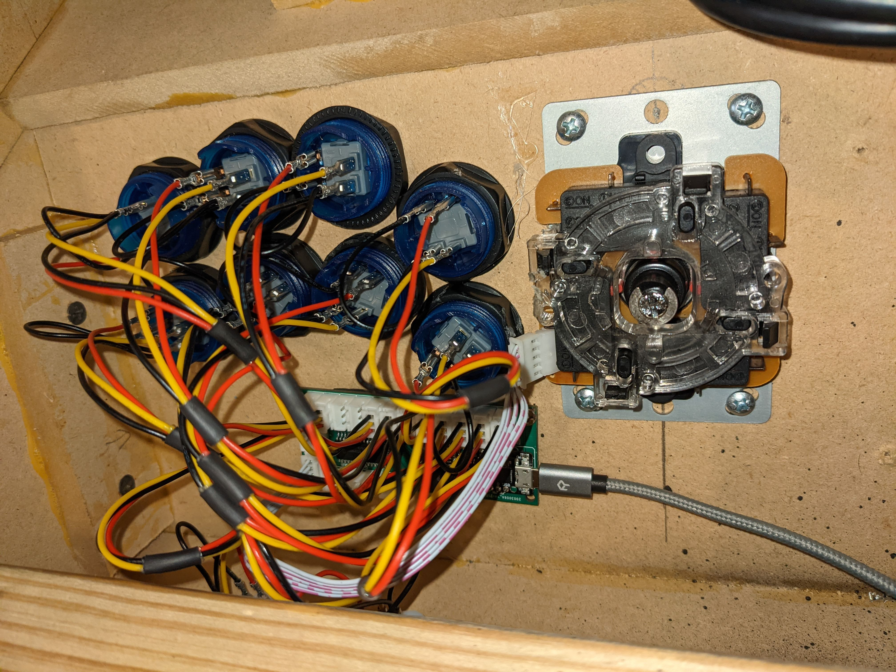

 # Assemble A New Board
 It's as simple as ordering a ready-to-go PCB from JLC-PCB, and soldering in the JST Connectors and Trinket M0 board.  I opted to solder the Trinket M0 Directly to the board. You can use headers if you prefer.
 
 If you prefer to etch your own board, you can access my [Schematic and PCB layout on OSHWLab](https://oshwlab.com/shaneapowell/arcadeilluminatev3)

## Order from JLCPCB
I have ready-to-go Gerber, BOM and PNP files that can be used on [JLCPCB.com](https://jlcpcb.com/).  I used these to build my batch of 10. All 10 came out perfectly. In the near future I plan to have a number of batches made by JLCPCB and sold as DIY Kits.
- [Gerber .zip file](pcb_gerber.zip)
- [BOM .csv file](pcb_bom.csv)
- [PickNPlace .csv file](dpcb_pnp.csv)

## Parts Needed
- [Event Horizon Circuit Board](https://oshwlab.com/shaneapowell/arcadeilluminatev3)
- [Adafruit Trinket M0](https://www.adafruit.com/product/3500) & Micro USB cable
- 12x B3B-XH JST thru-hole [Digikey #455-2231-ND](https://www.digikey.com/en/products/detail/jst-sales-america-inc/B3B-XH-AM(LF)(SN)/1651029)
- 5x B2B-XH JST thru-hole [Digikey #455-2273-ND](https://www.digikey.com/en/products/detail/jst-sales-america-inc/B2B-XH-AM(LF)(SN)/1016630)
- 1x B5B-XH JST thru-hole [Digikey #455-2239-ND](https://www.digikey.com/en/products/detail/jst-sales-america-inc/B5B-XH-AM(LF)(SN)/1651037)

Before from JLCPCB on the Left - After Soldering components on the Right

 # Pins
 
 ## Event Horizon
 - Each 3-pin JST Button connector can provide a safe 5v@15ma of power for each LED.  If you try to use a button that takes more than 15ma to light up it will cause damage to the board.  Be sure you are using a 5v LED button (see below).
 

 ## Joystick JST 5-pin (Sanwa)
 This is the joystick I have. The pins on the 5 pin connector on the joystcik are connected this way. This is the default firmware used on an EventHorizon board.  However, since the firmware is opensource, it will be very easy to provide different joystick pin mappings. The only requirement is the ground pin must be on pin 5. The Up,Down,Left,Right pins can be easily re-configured in the firmware.  (Future Firmwares will be able to have a configured rotation, or even a total remapping of each axis.)
 - Pin 1 = Up
 - Pin 2 = Down
 - Pin 3 = Right
 - Pin 4 = Left
 - Pin 5 = Ground

 
## Joystcik JST 5-pin (Seimitsu) (work in progress)
If you have a joysitck with the 5-pin connector configured this way, you can still use an Event Horizon board, but you'll need to correctly orient your 5-pin cable, and use the Seimitsu EventHorizon firmware (TBD).

## Buttons
Most Zero-Delay joystick and button kits indicate this wiring for "Always On" scenarios.  The Black wire is a common 5v, the yellow wire is the button signal, and the red-wire is the LED Ground wire.  This wiring is used by an Event Horizon board.  When connecting the wires to the button, it is critical that the wires are connected as shown.  Specifically, the red and black wires must be connected in this way or the LEDs will fail to operate. Even more dangerous, if by accident you connect the RED wire to the button trigger terminal, you will almost certainly short-circuit the EventHorizon internal electronics and destroy the board.

# Installed

